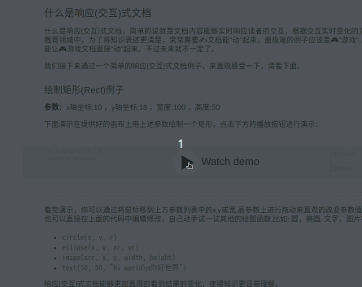

# hexo-next-imarkdown

This plugin will render the interactive markdown.


[](https://theme-next.org)
[](https://github.com/jiangtj/hexo-theme-cake)

## Preview & Docs
[](https://riceball.me/article/interative-markdown)

## Quick Start

### Install

```bash
# Create a new hexo project
hexo init <dir>
cd <dir>
# Add Theme-Next as git submodule
git init
git submodule add https://github.com/theme-next/hexo-theme-next themes/next
# remove the default marked render
yarn remove hexo-renderer-marked
# use the imarkdown render
yarn add hexo-next-imarkdown
# Set theme in main Hexo root config _config.yml file:
cat _config.yml
```

```yaml
# _config.yml
theme: next
```

### Configuration

You can config interactive markdown in `_config.yml` or `source/_data/imarkdown.yml`.

The following is the default configurations:

```yml
imarkdown:
  render:
    langPrefix: '' # DONT CHANGE
    html: true
    xhtmlOut: false
    breaks: true
    linkify: true
    typographer: true
    quotes: '“”‘’'
  anchors:
    level: 1
    collisionSuffix: ''
    tone: false
  plugins: full
```

The Interactive Markdown use the [markdown-it](https://github.com/markdown-it/markdown-it)as the renderer.

The full plugins include:

```yml
  plugins:
    - "markdown-it-interactive" # CAN NOT BE REMOVED
    - "markdown-it-highlight-i" # CAN NOT BE REMOVED
    - "markdown-it-cjk-breaks"
    - "markdown-it-deflist"
    - "markdown-it-abbr"
    - "markdown-it-container"
    - "markdown-it-footnote"
    - "markdown-it-ins"
    - "markdown-it-sub"
    - "markdown-it-sup"
    - "markdown-it-math"
    - "markdown-it-mark"
```


Now, You can write your interactive markdown document, remember you must enable it in your md file(front-matter):

````md
---
reactive: true
---

# Your Title
````

If you wanna reader can edit the code block on your article:

````md
---
reactive:
  editable: true
---

# Your Title
````


More Interactive Markdown introduction see here pls:

* [EN: Interactive Markdown](https://riceball.me/imarkdown/en)
* [CN: 交互式 Markdown](https://riceball.me/imarkdown)
* Simple Sample Markdown document: docs/example.md
